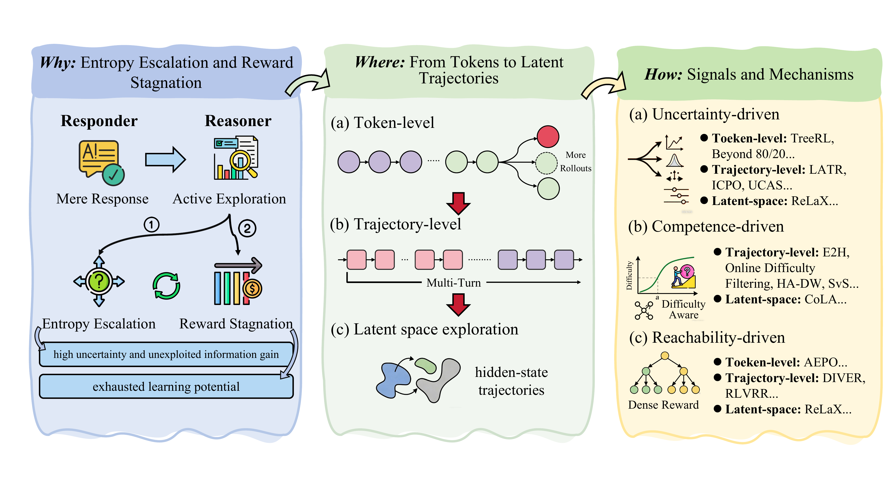
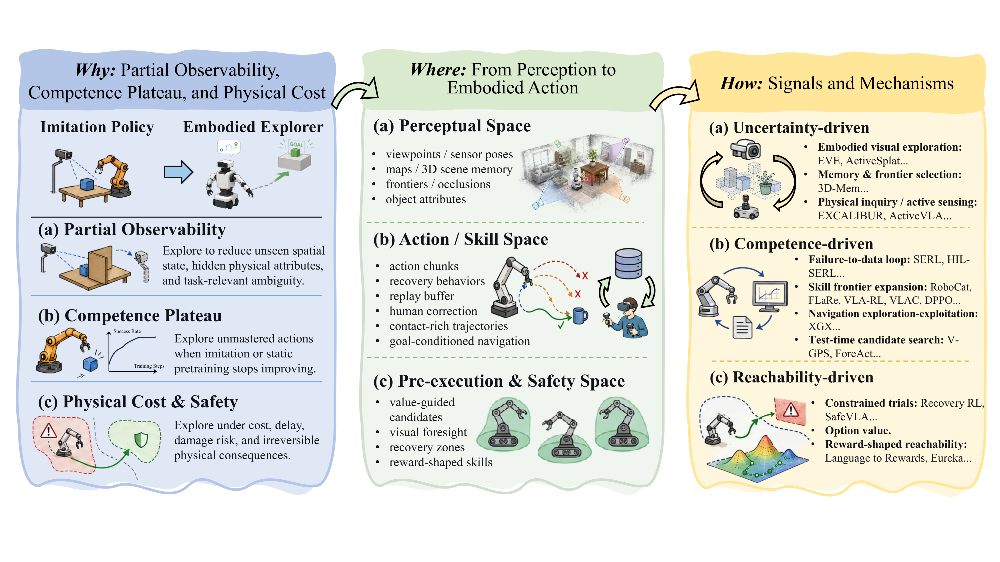
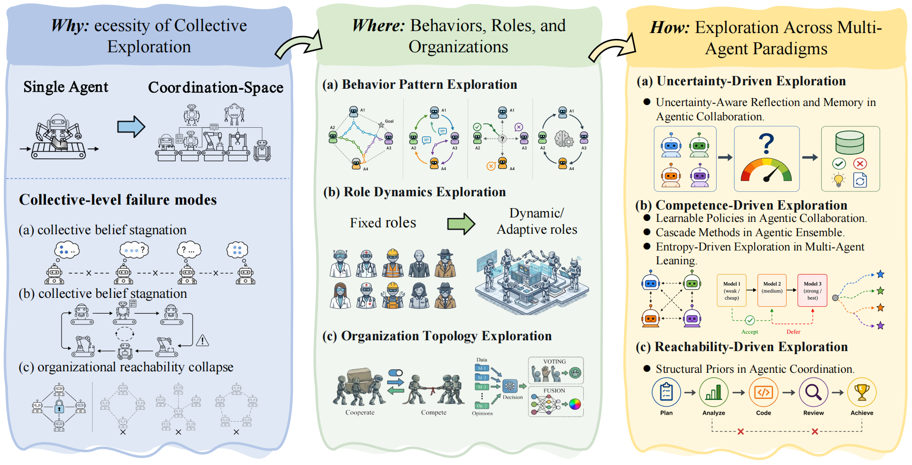

<h1 align="center">🔥 Awesome-Agent-Exploration

"Agent Exploration Toward Artificial General Intelligence: A Survey"</h2>


<p align="center">
  <b>◇ Responder → Reasoner → Agent → Prospector → Ecosystem ◇</b>
    <br>
   <i><b>🚀 Exploration as the Transition Mechanism 🚀</b></i>
</p>

<p align="center"></p>


<p align="center">
  <a href="https://papers.ssrn.com/sol3/papers.cfm?abstract_id=6748619"></a>
  <!-- <a href="#"></a> -->
  <a href="https://github.com/banyikun/epistemic_exploration"></a>
  <a href="https://awesome.re"></a>
  <a href="#"></a>
  <a href="#"></a>
  <a href="#"></a>
  </a>
  <a href=""></a>
</p>

<p align="center">
  <a href="https://github.com/banyikun/epistemic_exploration/stargazers"></a>
  <a href="https://github.com/banyikun/epistemic_exploration/network/members"></a>
  <a href="https://visitor-badge.laobi.icu/badge?page_id=banyikun.epistemic_exploration">
  
  </a>
</p>

<h4 align="center">If you find our survey helpful, please give it a star ⭐ to show your support！Thank you:)

</h4>


## 📣 Notices

> 🔥 **[2026-07] Update!** We have added **Prompt-Driven Exploration (PDE)** to **Level 3: Agent — Perception- & Action-Space Exploration → 3.2 Embodied Agents → 3.2.2 Planning**. This paper combines VLA models, LLMs, and prompt-based exploration to induce global, structured exploration beyond local action noise.

> 🔥 This is a curated paper list for the survey **"Agent Exploration Toward Artificial General Intelligence: A Survey"**, covering exploration mechanisms across reasoning, embodied AI, world models, and multi-agent systems.

> 🔥 **Stay tuned for our full paper release, incorporating the latest developments.**

> **[Always] [Add your papers]** We welcome all related papers! If you find any missed or new work, please open a Pull Request or contact us.

> **[Always] [Maintain]** We will keep this list updated frequently!

---


## Citation

If you find this survey useful, please cite:

```bibtex
@article{ban2026epistemic,
  title  = {Agent Exploration Toward Artificial General Intelligence: A Survey},
  author = {Ban, Yikun and Yang, Fengkai and Chen, Fangzheng and Wang, Yibo and Chen, Zhijun and Li, Zhongyi and Huang, Zixuan and Zhang, Xiaoyuan and Li, Gongxun and Chen, Zehao and others},
  year   = {2026},
  doi    = {10.5281/zenodo.20201414},
  url    = {https://doi.org/10.5281/zenodo.20201414}
}
```

---


## 1. Overview

It is not enough for AI systems to learn only what they are expected to learn. To move toward AGI, agents must also know what they do not know—and actively explore to acquire new information, capabilities, and experiences.  

We present a unified framework for exploration, named "Epistemic Exploration", connect it to insights from natural intelligence, reinforcement learning, and modern AI agents, and discuss how exploration may serve as a key mechanism driving the progression toward AGI. 

### 1.1 What is Epistemic Exploration?

> **Epistemic exploration** is the agent's capacity to actively acquire information that reduces its uncertainty about the world, convert that reduction into durable policy improvement, and keep future acquisition possible.

Unlike undirected exploration (e.g., ε-greedy), epistemic exploration is *intentional*, *belief-driven*, and *multi-scale*: the agent reasons about which actions are most informative and plans multi-step information-gathering strategies across reasoning trajectories, tool-use policies, embodied sensorimotor loops, world-model rollouts, and multi-agent coordination protocols.


## 📑 Table of Contents

- [📣 Notices](#-notices)
- [Citation](#citation)
- [1. Overview](#1-overview)
  - [1.1 What is Epistemic Exploration?](#11-what-is-epistemic-exploration)
- [📑 Table of Contents](#-table-of-contents)
  - [1.2 Three Criteria](#12-three-criteria)
  - [1.3 Unified Epistemic Exploration Objective](#13-unified-epistemic-exploration-objective)
  - [1.4 Five-Level Trajectory Toward AGI](#14-five-level-trajectory-toward-agi)
  - [1.5 3×5 Taxonomy](#15-35-taxonomy)
- [2. Levels 1–2: Responder → Reasoner — Reasoning-Space Exploration](#2-levels-12-responder--reasoner--reasoning-space-exploration)
  - [2.1 Token-Level Exploration: Local Branching via High-Entropy Tokens](#21-token-level-exploration-local-branching-via-high-entropy-tokens)
  - [2.2 Trajectory-Level Exploration: Diverse Solution Rollouts](#22-trajectory-level-exploration-diverse-solution-rollouts)
  - [2.3 Latent-Space Exploration: Searching Before Tokenization](#23-latent-space-exploration-searching-before-tokenization)
- [3. Level 3: Agent — Perception- \& Action-Space Exploration](#3-level-3-agent--perception---action-space-exploration)
  - [3.1 Digital Agents](#31-digital-agents)
    - [3.1.1 Tool Usage](#311-tool-usage)
    - [3.1.2 Planning](#312-planning)
    - [3.1.3 Memory Management](#313-memory-management)
  - [3.2 Embodied Agents](#32-embodied-agents)
    - [3.2.1 Perceptual & Semantic-Spatial Spaces](#321-perceptual--semantic-spatial-spaces)
    - [3.2.2 Action & Skill Spaces](#322-action--skill-spaces)
    - [3.2.3 Safety & Reachable Spaces](#323-safety--reachable-spaces)
- [4. Level 4: Prospector -- Imagination-Space Exploration](#4-level-4-prospector----imagination-space-exploration)
  - [4.1 Imagined Space: Active \& Optimistic Planning](#41-imagined-space-active--optimistic-planning)
  - [4.2 Risk Frontier: Safety-Critical Boundary Exploration](#42-risk-frontier-safety-critical-boundary-exploration)
  - [4.3 Value Landscape: Intrinsic Motivation \& Semantic Exploration](#43-value-landscape-intrinsic-motivation--semantic-exploration)
  - [4.4 Latent Manifold: Structured \& Self-Supervised Exploration](#44-latent-manifold-structured--self-supervised-exploration)
  - [Infrastructure Papers (6 papers, discussed in body text)](#infrastructure-papers-6-papers-discussed-in-body-text)
- [5. Level 5: Ecosystem — Coordination-Space Exploration](#5-level-5-ecosystem--coordination-space-exploration)
  - [5.1 Behavior Pattern Exploration](#51-behavior-pattern-exploration)
  - [5.2 Role Dynamics Exploration](#52-role-dynamics-exploration)
  - [5.3 Organization Topology Exploration](#53-organization-topology-exploration)
- [6. Exploration Evaluation](#6-exploration-evaluation)
  - [6.1 Principles \& Infrastructure](#61-principles--infrastructure)
  - [6.2 Reasoning-Space Evaluation](#62-reasoning-space-evaluation)
  - [6.3 Interaction-Space Evaluation](#63-interaction-space-evaluation)
    - [6.3.1 Digital Agents](#631-digital-agents)
    - [6.3.2 Embodied Agents](#632-embodied-agents)
  - [6.4 Imagination-Space Evaluation](#64-imagination-space-evaluation)
  - [6.5 Coordination-Space Evaluation](#65-coordination-space-evaluation)
  - [Biological Exploration Parallels](#biological-exploration-parallels)
  - [Open Challenges](#open-challenges)

---
<br>


### 1.2 Three Criteria

<p align="center"></p>
<p align="center"><i>Figure: Foundation of Epistemic Exploration — Why, What, and How.</i></p>

We ground epistemic exploration in **three jointly necessary criteria**, each addressing a distinct failure mode of static optimisation:

| Criterion | What It Does | Failure Mode Addressed | Explores... |
|:---------:|:-------------|:-----------------------|:------------|
| **C1: Information Gain** | Actively reduces epistemic uncertainty via belief-updating observations | *Belief Stagnation* — frozen internal model under distribution shift | ...where it knows least |
| **C2: Value Improvement** | Converts new information into durable policy improvement | *Value Stagnation* — local optima lock-in, surrogate misalignment | ...what it cannot yet do well |
| **C3: Epistemic Reachability** | Preserves positive visitation over belief-consistent regions | *Reachability Collapse* — irreversible contraction of behavioural diversity | ...where it might otherwise never go |

These form a closed loop: **gain information → convert to value → keep the capacity to gain information alive → ...**


### 1.3 Unified Epistemic Exploration Objective

The three criteria combine into a single constrained objective:

$$
\pi_{\mathfrak{A},t}^{*}
\=\
\underset{\underbrace{\pi_{\mathfrak{A}} \,\in\, \Pi_{\mathrm{reach}}(b_t)}_{\text{Reachability (C3)}}}{\arg\max}\
\underbrace{\mathbb{E}_{\theta \sim b_t} \Big[V^{\pi_{\mathfrak{A}}}_\theta(s_t, h_t)\Big]}_{\text{Value Improvement (C2)}}
\ +\ \beta \cdot
\underbrace{\mathbb{E}^{\pi_{\mathfrak{A}}}_{b_t} \left[\sum_{t'=t}^{\infty} \gamma^{\,t'-t}\,\mathcal{U}(s_{t'}, a_{t'};\, b_{t'})\right]}_{\text{Information Gain (C1)}}
$$


where $\mathcal{U}(s, a;\, b) = I(\theta;\, s', r \mid s, a, b)$ is epistemic uncertainty, and  $\Pi_{\mathrm{reach}}(b_t)$ is the reachability-feasible policy set.


**Reading the objective.** The three terms map one-to-one onto the three criteria:

- **Information-gain term (C1)** — expected cumulative epistemic uncertainty the agent anticipates resolving along its trajectory. 
- **Value Improvement (C2)** — expected cumulative reward under current beliefs; what a pure exploiter would maximise.
- **Reachability (C3)** — visitation must remain over every region plausibly relevant under beliefs, preventing short-term gains from foreclosing future learning.


### 1.4 Five-Level Trajectory Toward AGI

We propose exploration as the **transition mechanism** between five levels of increasing agent sophistication. Each level introduces a qualitatively new exploration space that the previous level cannot access:

| Transition | Exploration Space | What Becomes Explorable |
|:-----------|:------------------|:------------------------|
| **L1 → L2: Responder → Reasoner** | **Reasoning space** | Hypotheses, alternative reasoning trajectories, latent thought representations; self-verification and revision |
| **L2 → L3: Reasoner → Agent** | **Interaction space** | Embodied perception, tool invocation, memory management, closed-loop action under partial observability |
| **L3 → L4: Agent → Prospector** | **Imagination space** | Counterfactual futures in learned world models; the dual exploration problem across real and imagined environments |
| **L4 → L5: Prospector → Ecosystem** | **Coordination space** | Communication topologies, co-evolving role specialisations, shared representations, collaborative strategies |

### 1.5 3×5 Taxonomy

Our survey is organized as a **3×5 taxonomy** crossing three signal-driven methodologies with the five levels:

| | **L1 Responder** | **L2 Reasoner** | **L3 Agent** | **L4 Prospector** | **L5 Ecosystem** |
|---|---|---|---|---|---|
| **Uncertainty-Driven** | *— (single forward pass; no internal search)* | Token / step entropy, entropy-guided branching | Active SLAM, prediction variance, pose uncertainty | Ensemble disagreement in latent world models | Inter-agent disagreement, joint-belief uncertainty |
| **Competence-Driven** | *— (no learning loop at inference)* | Difficulty-adaptive curricula, self-verification, self-play | Skill bootstrapping, goal-conditioned self-play | Imagination-based skill discovery, learning-progress curricula | Emergent multi-agent self-play, co-evolving curricula |
| **Reachability-Driven** | *— (fixed output manifold)* | Beam diversity, anti-repetition, KL-to-reference trust regions | Go-Explore, coverage-maximising curricula | Latent-space diversity bonuses, action-entropy regularisation | Role-diversity bonuses, anti-convergence on coordination topologies |


---
<br>


## 2. Levels 1–2: Responder → Reasoner — Reasoning-Space Exploration

The transition from **Responder** to **Reasoner** requires exploration in *reasoning space*: branching over token sequences, reasoning trajectories, and latent thought representations. The agent must search for informative hypotheses rather than simply produce reactive outputs.

<p align="center"></p>
<p align="center"><i>Figure: Levels 1–2 Reasoning-Space Exploration — Why (entropy escalation & reward stagnation), Where (tokens → turns → latent trajectories), and How (uncertainty / competence / reachability-driven).</i></p>

<br>

### 2.1 Token-Level Exploration: Local Branching via High-Entropy Tokens

Token-level exploration focuses on local uncertain decision points in the next-token distribution, since a few decisive tokens can redirect the subsequent proof, program, or explanation. Existing methods identify high-entropy tokens as reasoning forks and branch from these positions.

| Date | Method | Key Idea | How | Paper | Github |
|:---:|:-------|:---------|:----|:------|:---:|
| 2025-06 | **TreeRL** | Explores reasoning via on-policy tree search from uncertain intermediate states | Uncertainty | [TreeRL: LLM Reinforcement Learning with On-Policy Tree Search](https://arxiv.org/abs/2506.11902) | [](https://github.com/THUDM/TreeRL) |
| 2025-06 | **Beyond 80/20** | Identifies high-entropy tokens as key reasoning forks | Uncertainty | [Beyond the 80/20 Rule: High-Entropy Minority Tokens Drive Effective Reinforcement Learning for LLM Reasoning](https://arxiv.org/abs/2506.01939) | [](https://github.com/Shenzhi-Wang/Beyond-the-80-20-Rule-RLVR) |
| 2025-10 | **AEPO** | Breaks the exploration bottleneck by directly controlling policy entropy through temperature-guided REINFORCE | Reachability | [Arbitrary Entropy Policy Optimization Breaks The Exploration Bottleneck of Reinforcement Learning](https://arxiv.org/pdf/2510.08141) | [](https://github.com/597358816/AEPO) |
| 2026-06 | **Boundary-aware Curriculum RL** | Expands task-level exploration beyond the base model’s reasoning boundary through curriculum learning | Competence | [Curriculum Reinforcement Learning Can Incentivize Reasoning Capacity in LLMs Beyond the Base Model](https://arxiv.org/html/2606.22317v1) | - |
<br>

### 2.2 Trajectory-Level Exploration: Diverse Solution Rollouts

Trajectory-level exploration treats the complete chain-of-thought or solution rollout as the basic unit of search and reward, making it especially suitable for verifiable-reward training. 

| Date | Method | Key Idea | How | Paper | Github |
|:---:|:-------|:---------|:----|:------|:---:|
| 2025-10 | **LATR** | Improves RLVR by explicitly enforcing trajectory-level diversity during group rollouts | Uncertainty | [Lookahead Tree-Based Rollouts for Enhanced Trajectory-Level Exploration in Reinforcement Learning with Verifiable Rewards](https://arxiv.org/abs/2510.24302) | [](https://github.com/starreeze/latr) |
| 2025-10 | **UCAS** | Promotes exploration by boosting uncertain-but-correct reasoning paths | Uncertainty | [Unlocking Exploration in RLVR: Uncertainty-aware Advantage Shaping for Deeper Reasoning](https://arxiv.org/abs/2510.10649) | [](https://github.com/xvolcano02/UCAS) |
| 2025-11 | **ICPO** | Promotes exploration by combining verifiable rewards with confidence-based preference advantages | Uncertainty | [ICPO: Intrinsic Confidence-Driven Group Relative Preference Optimization for Efficient Reinforcement Learning](https://arxiv.org/abs/2511.21005) | - |
| 2025-06 | **E2H** | Guides exploration through an easy-to-hard curriculum | Competence | [Curriculum Reinforcement Learning from Easy to Hard Tasks Improves LLM Reasoning](https://arxiv.org/abs/2506.06632) | [](https://github.com/divelab/E2H-Reasoning) |
| 2026-01 | **HA-DW** | Reduces exploration imbalance by debiasing group-relative advantages across prompt difficulty | Competence | [Your Group-Relative Advantage Is Biased](https://arxiv.org/abs/2601.08521) | - |
| 2025-08 | **SvS** | Sustains exploration by self-synthesizing diverse but answer-equivalent problems during RLVR | Competence | [Beyond Pass@1: Self-play with Variational Problem Synthesis Sustains RLVR](https://arxiv.org/pdf/2508.14029) | [](https://github.com/MasterVito/SvS) |
| 2026-01 | **RLVRR** | Turns sparse end rewards into a verifiable reward chain that supports broader open-ended exploration | Reachability | [From Verifiable Dot to Reward Chain: Harnessing Verifiable Reference-based Rewards for Reinforcement Learning of Open-ended Generation](https://arxiv.org/abs/2601.18533) | [](https://github.com/YJiangcm/RLVRR) |

<br>

### 2.3 Latent-Space Exploration: Searching Before Tokenization

Latent-space exploration searches over hidden states or compact latent actions before committing to natural-language tokens, allowing the model to represent multiple possible continuations internally.

| Date | Method | Key Idea | How | Paper | Github |
|:---:|:-------|:---------|:----|:------|:---:|
| 2025-12 | **ReLaX** | Promotes exploration by regulating latent hidden-state dynamics beyond token-level entropy | Reachability | [ReLaX: Reasoning with Latent Exploration for Large Reasoning Models](https://arxiv.org/abs/2512.07558) | [](https://github.com/ZhangShimin1/ReLaX/stargazers)|
|2026-4 | **ESamp**| uses the prediction error as a novelty signal to reweight candidate token extensions conditioned on the current prefix|  Uncertainty   |      [Large Language Models Explore by Latent Distilling](https://arxiv.org/abs/2604.24927) |[](https://github.com/LinesHogan/tLLM/stargazers) |

---

<br>


## 3. Level 3: Agent — Perception- & Action-Space Exploration

At Level 3, the agent crosses a qualitative boundary: it moves from purely internal reasoning into situated interaction with external environments. The "Reasoner" of Levels 1–2 generates hypotheses within its own token space; the "Agent" must act on those hypotheses—querying databases, invoking APIs, reorienting sensors, or manipulating physical objects—and update its beliefs from the consequences. Exploration can no longer be confined to branching over reasoning trajectories; it now unfolds in perception and action space, where every exploratory step incurs real cost (latency, API calls, energy, or irreversible physical change).

### 3.1 Digital Agents

Digital agents operate in software-mediated environments—web browsers, code interpreters, file systems, and tool APIs. Their action space is discrete and combinatorial (which tool to call, with what arguments, in what order), feedback is fast but often sparse, and the primary exploration challenge is discovering effective tool-invocation policies across a vast combinatorial manifold.

We organize digital-agent exploration by the **Where** dimension: the interface where exploration is instantiated. In digital environments, exploration primarily appears in **tool usage**, **planning**, and **memory management**. The **How** column keeps the three epistemic-exploration methodologies: uncertainty-driven, competence-driven, and reachability-driven.

#### 3.1.1 Tool Usage

Tool usage is the executable interface through which a digital agent extends its native language-model capability with external computation and environment interaction. Exploration here concerns which tool to call, how to parameterize the call, how to branch over alternative function-call paths, and how to use tool feedback for self-verification.

| Date | Method | Key Idea | How | Paper | Github |
|:---:|:-------|:---------|:----|:------|:---:|
| 2025-11 | **Agent0-VL** | Uses Solver-Verifier self-play to generate process rewards and repair signals for tool-integrated vision-language reasoning | Competence | [Agent0-VL: Exploring Self-Evolving Agent for Tool-Integrated Vision-Language Reasoning](https://arxiv.org/abs/2511.19900) | [](https://github.com/aiming-lab/Agent0) |
| 2025-08 | **EGPO** | Adds entropy bonuses to encourage high-entropy exploration over function-call trajectories during RL | Reachability | [Reasoning through Exploration: A Reinforcement Learning Framework for Robust Function Calling](https://arxiv.org/abs/2508.05118) | [](https://github.com/BingguangHao/RLFC) |
| 2026-03 | **RAPO** | Retrieves off-policy step-level traces during rollout to expand exploration beyond self-generated tool-use trajectories | Reachability | [RAPO: Expanding Exploration for LLM Agents via Retrieval-Augmented Policy Optimization](https://arxiv.org/abs/2603.03078) | - |
| 2026-04 | **E³-TIR** | Exploits external or expert experience to expose useful tool-use branches beyond pure on-policy sampling | Reachability | [E3-TIR: Enhanced Experience Exploitation for Tool-Integrated Reasoning](https://arxiv.org/abs/2604.09455) | [](https://github.com/yuki-younai/E3-TIR) |

#### 3.1.2 Planning

Planning provides the decision structure through which a digital agent decomposes tasks, selects intermediate actions, revises strategies, and coordinates multi-step interaction with an environment. Exploration here searches over reasoning paths, subgoals, task curricula, and trajectory-level policies before or during execution.

| Date | Method | Key Idea | How | Paper | Github |
|:---:|:-------|:---------|:----|:------|:---:|
| 2025-04 | **KnowSelf** | Routes the agent among direct execution, reflection, and knowledge invocation according to self-perceived uncertainty | Uncertainty | [Agentic Knowledgeable Self-awareness](https://arxiv.org/abs/2504.03553) | [](https://github.com/zjunlp/KnowSelf) |
| 2025-08 | **PilotRL** | Uses a global-planning-guided progressive curriculum from plan following to plan generation and planner-executor coordination | Competence | [PilotRL: Training Language Model Agents via Global Planning-Guided Progressive Reinforcement Learning](https://arxiv.org/abs/2508.00344) | - |
| 2026-05 | **EAPO** | Assigns fine-grained exploration rewards to intermediate actions for exploration-aware agentic credit assignment | Competence | [Learning to Explore: Scaling Agentic Reasoning via Exploration-Aware Policy Optimization](https://arxiv.org/abs/2605.08978) | [](https://github.com/HansenHua/EAPO-ICML26) |
| 2025-05 | **GiGPO** | Groups matched intermediate states across rollouts to compute state-level relative advantages for finer-grained policy updates | Competence | [Group-in-Group Policy Optimization for LLM Agent Training](https://arxiv.org/abs/2505.10978) | [](https://github.com/langfengQ/verl-agent) |
| 2025-05 | **Absolute Zero** | Uses reinforced self-play to generate its own task curriculum and learning signals without external data | Competence | [Absolute Zero: Reinforced Self-play Reasoning with Zero Data](https://arxiv.org/abs/2505.03335) | [](https://github.com/LeapLabTHU/Absolute-Zero-Reasoner) |
| 2025-09 | **EPO** | Regulates trajectory-level entropy in multi-turn agent RL to prevent exploration-exploitation cascade failures | Reachability | [EPO: Entropy-regularized Policy Optimization for LLM Agents Reinforcement Learning](https://arxiv.org/abs/2509.22576) | [](https://github.com/WujiangXu/EPO) |

#### 3.1.3 Memory Management

Memory management provides temporal continuity by preserving information beyond the immediate context window. Exploration here concerns what interaction history, posterior belief, retrieved evidence, or compressed summary should condition future decisions.

| Date | Method | Key Idea | How | Paper | Github |
|:---:|:-------|:---------|:----|:------|:---:|
| 2026-01 | **JitRL** | Retrieves past state-action-return experiences to estimate just-in-time action advantages without gradient updates | Uncertainty | [Just-In-Time Reinforcement Learning: Continual Learning in LLM Agents Without Gradient Updates](https://arxiv.org/abs/2601.18510) | [](https://github.com/liushiliushi/JitRL) |
| 2025-04 | **PSRL Agent** | Maintains textual posteriors over environment dynamics and rewards, then samples hypotheses to guide efficient exploration | Uncertainty | [Toward Efficient Exploration by Large Language Model Agents](https://arxiv.org/abs/2504.20997) | - |
| 2025-01 | **Search-o1** | Retrieves and refines external knowledge when reasoning exposes uncertainty or missing evidence | Uncertainty | [Search-o1: Agentic Search-Enhanced Large Reasoning Models](https://doi.org/10.18653/v1/2025.emnlp-main.276) | [](https://github.com/RUC-NLPIR/Search-o1) |
| 2025-09 | **ReSum-GRPO** | Compresses long interaction histories into reusable summaries that allow long-horizon search to continue across context limits | Competence | [ReSum: Unlocking Long-Horizon Search Intelligence via Context Summarization](https://arxiv.org/abs/2509.13313) | - |

<br>

### 3.2 Embodied Agents

<p align="center"></p>
<p align="center"><i>Figure: Level 3 Embodied Agent Exploration — Perception, Planning/Decision, and Action.</i></p>

Embodied agents—robotic manipulators, autonomous vehicles, navigation systems—explore in a continuous, high-dimensional action space defined by physical effectors and multimodal sensors. The cost of exploration is fundamentally different from the digital setting: every physical interaction consumes time, energy, and mechanical wear, and many actions are irreversible. We organize embodied exploration by the **Where** dimension (i.e. which subsystem performs exploration):

#### 3.2.1 Perception

The carrier of perceptual exploration is sensor-grounded evidence: viewpoints, sensor poses, partial maps, scene memories, and physical inquiry results. The agent actively selects camera poses or physical interactions to expose unseen regions, discover objects, and test physical attributes.

| Date | Method | Key Idea | How | Paper | Github |
|:---:|:-------|:---------|:----|:------|:---:|
| 2021-04 | **EVE** | Defines embodied visual exploration over informative views and trajectories | Uncertainty | [An Exploration of Embodied Visual Exploration](https://arxiv.org/abs/2104.14552) | - |
| 2023-04 | **EXCALIBUR** | Open-ended physical exploration to test material properties before language reasoning | Uncertainty | [EXCALIBUR: Encouraging and Evaluating Embodied Exploration](https://arxiv.org/abs/2304.09051) | [](https://github.com/allenai/excalibur) |
| 2024-10 | **ActiveSplat** | Unifies online mapping, viewpoint selection, and path planning into an active reconstruction system | Uncertainty | [ActiveSplat: High-Fidelity Scene Reconstruction through Active Gaussian Splatting](https://arxiv.org/abs/2410.21955) | [](https://github.com/Li-Yuetao/ActiveSplat) |
| 2025-02 | **3D-Mem** | Represents explored regions as memory snapshots and unexplored regions as frontier snapshots | Reachability | [3D-Mem: 3D Scene Memory for Embodied Exploration and Reasoning](https://arxiv.org/abs/2502.16480) | - |

#### 3.2.2 Planning & Decision

Exploration at the planning and decision-making level involves searching over target locations, language-conditioned goals, candidate subgoals, and plan repairs before physical movement occurs.

| Date | Method | Key Idea | How | Paper | Github |
|:---:|:-------|:---------|:----|:------|:---:|
| 2020-07 | **SemExp** | Explores by building semantic maps to decide the next exploration area | Uncertainty | [Object Goal Navigation using Goal-Oriented Semantic Exploration](https://arxiv.org/abs/2007.00643) | [](https://github.com/devendrachaplot/Object-Goal-Navigation) |
| 2022-01 | **PONI** | Predicts "where to look" by predicting potential functions on a semantic map | Uncertainty | [PONI: Potential Functions for ObjectGoal Navigation...](https://arxiv.org/abs/2201.10029) | [](https://github.com/srama2512/PONI) |
| 2023-01 | **CoW** | CLIP object localization + classical exploration as a strong zero-shot baseline | Uncertainty | [CoWs on Pasture: Baselines and Benchmarks for Language-Driven Zero-Shot Object Navigation](https://arxiv.org/abs/2301.10489) | [](https://github.com/samirgadre/cows) |
| 2023-12 | **VLFM** | Uses VLM to evaluate the language-grounded value of frontiers for semantic navigation | Uncertainty | [VLFM: Vision-Language Frontier Maps for Zero-Shot Semantic Navigation](https://arxiv.org/abs/2312.03281) | [](https://github.com/bdaiinstitute/vlfm) |
| 2023-05 | **Voyager** | Explores open worlds using an automatic curriculum, skill library, and self-driven exploration | Competence / Reachability | [Voyager: An Open-Ended Embodied Agent with Large Language Models](https://arxiv.org/abs/2305.16291) | [](https://github.com/MineDojo/Voyager) |
| 2023-02 | **DEPS** | Describes, explains, plans, and selects candidate subgoals to repair execution failures | Competence / Reachability | [Describe, Explain, Plan and Select: Interactive Planning with LLMs...](https://arxiv.org/abs/2302.01560) | [](https://github.com/craftjarvis/MC-Planner) |
| 2024-10 | **V-GPS** | Uses an offline RL value function to rerank candidate actions from a generalist policy before execution | Competence / Reachability | [Steering Your Generalists: Improving Robotic Foundation Models via Value Guidance](https://arxiv.org/abs/2410.13816) | - |
| 2026-07 | **Prompt-Driven Exploration (PDE)** | Uses a VLM to diagnose failures and dynamically rewrite natural-language prompts to induce global, structured exploration in VLAs | Uncertainty / Competence | [Prompt-Driven Exploration](https://arxiv.org/abs/2607.08837) | - |

#### 3.2.3 Action

Action-level exploration involves physical trial-and-error, corrective fine-tuning, and expanding the agent's behavior repertoire through real-world interactions.

| Date | Method | Key Idea | How | Paper | Github |
|:---:|:-------|:---------|:----|:------|:---:|
| 2024-10 | **HIL-SERL** | Interleaves human corrections with off-policy RL to explore and correct errors on real robots | Uncertainty / Competence | [Precise and Dexterous Robotic Manipulation via Human-in-the-Loop RL](https://arxiv.org/abs/2410.21845) | [](https://github.com/rail-berkeley/hil-serl) |
| 2024-09 | **DPPO** | Structured, on-manifold exploration for RL fine-tuning of continuous diffusion policies | Competence | [Diffusion Policy Policy Optimization](https://arxiv.org/abs/2409.00588) | [](https://github.com/irom-princeton/dppo) |
| 2021-04 | **MT-Opt** | Shares exploration, experience, and representations across real-world multi-task robotic RL | Reachability | [MT-Opt: Continuous Multi-Task Robotic Reinforcement Learning at Scale](https://arxiv.org/abs/2104.08212) | - |
| 2021-04 | **MTRF** | Reset-free exploration where different tasks provide start states for one another | Reachability | [Reset-Free Reinforcement Learning via Multi-Task Learning...](https://arxiv.org/abs/2104.11203) | - |


---

<br>

## 4. Level 4: Prospector -- Imagination-Space Exploration

At Levels 1--3, exploration operates within spaces the agent directly inhabits. Level 4 introduces a qualitatively different regime: exploration within **learned world models**---internal simulators that approximate environment dynamics and enable imagination-driven planning. This shift transforms exploration from costly physical trial-and-error to efficient mental simulation, where agents evaluate counterfactual futures and discover strategies without real-world consequences.

The world model serves as a cognitive sandbox where the agent navigates latent manifolds, generates simulated rollouts, and probes epistemic boundaries. This dual exploration regime introduces unique challenges: prediction errors compound over imagined horizons, uncertainty must be disentangled from irreducible noise, and safety-critical details risk being lost in latent compression. The exploration objective shifts from ``which action to take'' to ``which latent configurations are worth visiting, which imagined trajectories are physically plausible, and how can intrinsic signals guide exploration when external feedback is absent.''

<p align="center"></p>
<p align="center"><i>Figure: Level 4 Imagination-Space Exploration -- Why (dual exploration problem: reality drift, noise hijacking, detail loss), Where (imagined space, risk frontier, value landscape, latent manifold), and How (uncertainty-driven, competence-driven, reachability-driven, self-supervised).</i></p>

<br>

### 4.1 Imagined Space: Active & Optimistic Planning

Imagined-space exploration operates within the internal simulation of the world model, where agents generate trajectories thousands of times faster than physical experiments. Methods here focus on planning to explore---maximizing expected novelty in imagined states through ensemble disagreement, optimistic dynamics, or state archiving.

| Date | Method | Key Idea | How | Paper | Github |
|:---:|:-------|:---------|:---|:------|:---:|
| 2019-06 | **MAX** | Maximizes Bayesian novelty via forward-model ensembles to plan observation of novel events | Uncertainty | [Model-Based Active Exploration](https://arxiv.org/abs/1810.12162) | - |
| 2020-05 | **Plan2Explore** | First ``plan to explore'' method: decouples exploration from task reward via latent ensemble disagreement in imagined space | Uncertainty | [Planning to Explore via Self-Supervised World Models](https://arxiv.org/abs/2005.05960) | - |
| 2021-02 | **Go-Explore** | ``Return-then-explore'' paradigm with explicit state archive and goal-conditioned return policies | Reachability | [First return, then explore](https://doi.org/10.1038/s41586-020-03157-9) | - |
| 2026-02 | **Optimistic WM** | RBMLE-based optimism directly into world model learning; gradient-based optimistic dynamics without ensemble estimation | Uncertainty | [Optimistic World Models](https://arxiv.org/abs/2602.10044) | - |

<br>

### 4.2 Risk Frontier: Safety-Critical Boundary Exploration

Risk-frontier exploration requires probing operational boundaries to identify failure modes. In safety-critical domains, agents must deliberately seek out regions of high epistemic uncertainty at the edge of their competence, resolving model uncertainty through risk-seeking trajectory optimization.

| Date | Method | Key Idea | How | Paper | Github |
|:---:|:-------|:---------|:---|:------|:---:|
| 2019-04 | **Curious iLQR** | Bayesian dynamics + risk-seeking iLQR to resolve model uncertainty at operational boundaries | Uncertainty | [Curious iLQR: Resolving Uncertainty in Model-based RL](https://arxiv.org/abs/1904.06786) | - |

<br>

### 4.3 Value Landscape: Intrinsic Motivation & Semantic Exploration

Value-landscape exploration constructs internal value surfaces through intrinsic motivation when dense external rewards are absent. Methods here span from classical prediction-error curiosity to foundation-model-guided semantic exploration, covering the full spectrum of self-generated reward signals.

| Date | Method | Key Idea | How | Paper | Github |
|:---:|:-------|:---------|:---|:------|:---:|
| 1991 | **Schmidhuber** | Foundational theory: curiosity as intrinsic reward proportional to world-model learning progress | Uncertainty | [A Possibility for Implementing Curiosity and Boredom](https://direct.mit.edu/books/edited-volume/3865/chapter/162771/A-Possibility-for-Implementing-Curiosity-and) | - |
| 2016 | **VIME** | Variational information maximization: Bayesian neural network provides information-gain intrinsic rewards | Uncertainty | [VIME: Variational Information Maximizing Exploration](https://arxiv.org/abs/1605.09674) | [](https://github.com/matthewlujp/VIME) |
| 2021 | **SelMo** | Pure curiosity optimization within world model generates diverse manipulation and locomotion behaviors | Uncertainty | [Is Curiosity All You Need?](https://deepmind.google/discover/blog/is-curiosity-all-you-need-on-the-utility-of-emergent-behaviours-from-curious-exploration/) | - |
| 2023 | **Hindsight Curiosity** | Retrospective curiosity: asks ``should I have predicted this?'' to avoid noise-hijacking in stochastic environments | Uncertainty | [Curiosity in Hindsight](https://arxiv.org/abs/2211.10515) | - |
| 2025 | **Mantiuk** | Curiosity and competence co-evolve with world model learning in a feedback loop | Competence / Uncertainty | [From Curiosity to Competence](https://arxiv.org/abs/2507.08210) | - |
| 2025 | **SENSEI** | Foundation models guide semantic exploration toward meaningful behaviors | Competence / Uncertainty | [SENSEI: Semantic Exploration Guided by Foundation Models](https://arxiv.org/abs/2503.01584) | - |

<br>

### 4.4 Latent Manifold: Structured & Self-Supervised Exploration

Latent-manifold exploration operates on the compressed representation spaces learned by world models, where semantically similar states cluster. Methods here inject structure (object-centric, relational, geometric) into exploration or achieve exploration purely through self-supervised predictive learning.

| Date | Method | Key Idea | How | Paper | Github |
|:---:|:-------|:---------|:---|:------|:---:|
| 2020 | **LWM** | Self-supervised temporal representations for novelty detection in hard-exploration Atari games | Self-supervised / Uncertainty | [Latent World Models for Intrinsically Motivated Exploration](https://proceedings.neurips.cc/paper/2020/hash/3c09bb10e2189124fdd8f467cc8b55a7-Abstract.html) | - |
| 2023 | **Sergeant-Perthuis** | Geometry of WM (Euclidean vs.~projective) fundamentally impacts epistemic value and curiosity | Structured / Uncertainty | [Influence of the Geometry of the World Model on Curiosity Based Exploration](https://arxiv.org/abs/2304.00188) | - |
| 2022 | **Sancaktar** | Relational inductive biases for compositional multi-object exploration with structured world models | Structured / Uncertainty | [Curious Exploration via Structured World Models](https://arxiv.org/abs/2206.11403) | - |
| 2025 | **GX-Chen** | Object-centric abstraction with discriminative WM for efficient count-based exploration planning | Structured / Uncertainty | [Efficient Exploration with Object-Centric Abstraction](https://arxiv.org/abs/2408.11816) | - |
| 2025 | **Santana** | Exploration policies learned entirely from self-supervised predictive WM training without external reward | Self-supervised | [Learning To Explore With Predictive World Model](https://arxiv.org/abs/2502.13200) | - |
| 2026 | **One Life** | Infer symbolic programmatic world models from minimal unguided exploration in stochastic environments | Self-supervised | [One Life to Learn](https://openreview.net/forum?id=UQ36IrVCw2) | [](https://github.com/codezakh/onelife) |
| 2024 | **SeeX** | Separated world model extracts endogenous/exogenous info for robust exploration in visual distractor environments | Uncertainty | [Leveraging Separated World Model for Exploration](https://proceedings.neurips.cc/paper_files/paper/2024/hash/96189e90e599ccc43f00434ff3ed0312-Abstract-Conference.html) | - |
| 2025 | **InDRiVE** | Ensemble-disagreement curiosity extended to autonomous driving via Dreamer-style world models | Uncertainty | [InDRiVE: Intrinsic Disagreement-based Reinforcement for Vehicle Exploration](https://arxiv.org/abs/2503.05573) | - |

<br>

---

### Infrastructure Papers (6 papers, discussed in body text)

The following six papers provide the world model architecture and algorithmic foundation for the exploration methods above:

| Date | Method | Key Idea | How | Paper | Github |
|:---:|:-------|:---------|:---|:------|:---:|
| 2018 | **World Models** | V-M-C architecture: VAE compresses observations, RNN predicts latent dynamics, controller evolves in imagination | Infrastructure (Imagination) | [Recurrent World Models Facilitate Policy Evolution](https://arxiv.org/abs/1809.01999) | [](https://github.com/danijar/dreamerv3) |
| 2019 | **PlaNet** | RSSM for latent-space planning; decomposes latent states into deterministic and stochastic components | Infrastructure (Planning) | [Learning Latent Dynamics for Planning from Pixels](https://arxiv.org/abs/1811.04551) | - |
| 2020 | **Dreamer** | Actor-critic training within imagined latent space of RSSM world model | Infrastructure (Imagination) | [Dream to Control](https://arxiv.org/abs/1912.01603) | - |
| 2023 | **DreamerV3** | Single WM algorithm masters diverse domains without hyperparameter tuning | Infrastructure (Scaling) | [Mastering Diverse Domains through World Models](https://arxiv.org/abs/2301.04104) | [](https://github.com/danijar/dreamerv3) |
| 2022 | **DayDreamer** | Dreamer transferred from simulation to physical robots | Infrastructure (Real-world) | [DayDreamer: World Models for Physical Robot Learning](https://arxiv.org/abs/2206.14176) | [](https://github.com/danijar/daydreamer) |
| 2026 | **R2-Dreamer** | Eliminates decoders and augmentation; redundancy reduction improves exploration | Infrastructure (Efficiency) | [R2-Dreamer](https://arxiv.org/abs/2603.18202) | - |

<br>

**Summary Statistics:** 25 papers total (19 core exploration + 6 infrastructure), spanning 1991--2026. Core methods are distributed across 4 exploration spaces (Imagined Space, Risk Frontier, Value Landscape, Latent Manifold) with How drivers: Uncertainty (13), Self-supervised / Uncertainty (3), Structured / Uncertainty (3), Reachability (1), Competence / Uncertainty (2), Self-supervised (2).

---

<br>


## 5. Level 5: Ecosystem — Coordination-Space Exploration

<p align="center"></p>
<p align="center"><i>Figure: Level 5 Coordination-Space Exploration — Why (single-agent limitations), Where (communication, collaboration, role, deployment), and How (orchestration, ensemble, MARL, self-evolving agents).</i></p>

<!-- At the highest level, exploration enters **coordination space**: heterogeneous agents discover communication topologies, role specialisations, shared representations, and collaborative strategies. -->

At Level 5, exploration transcends the individual agent entirely. The object of exploration is no longer a reasoning trajectory, an action sequence, or an imagined future, but the *coordination structure* itself — communication protocols, collaboration topologies, role assignments, and collective knowledge substrates. The central question shifts from "how should a single agent explore?" to "how should a population of heterogeneous agents organise their joint exploration?"

This transition is not merely about scaling the number of agents. Single-agent systems face fundamental limitations in capability coverage, robustness, and adaptability when confronting tasks that require cross-domain knowledge, long-horizon planning, and multi-step verification. Static multi-agent architectures with fixed interaction pathways suppress structural exploration, restricting adaptability to dynamic environments. Domain-specific tasks demand structured collaboration with specialised roles and verification steps to reduce hallucinations and ensure executability. And unconstrained multi-agent deployment introduces substantial computational overhead, requiring resource-efficient coordination strategies. Level 5 addresses these challenges by making the organisation of intelligence itself — how agents communicate, coordinate, specialise, compose, and co-evolve — the target of exploration.


| Challenge | Description |
|:----------|:------------|
| **Scalable Coordination Exploration** | The search space is combinatorial, hierarchical, and dynamic—which agents to activate, what communication to establish, how information flows |
| **Ecosystem-Level Credit Assignment** | Disentangling behavioural contribution from structural contribution under sparse, delayed feedback |
| **Diversity vs. Convergence Tension** | Balancing ecological diversity against system-level coherence |
| **Role–Communication Co-evolution** | Jointly evolving functional specialisation and information exchange protocols |

<!-- **Key Systems & Methods:**

| Method | Key Contribution |
|:-------|:-----------------|
| **MetaGPT** | Structured multi-agent coordination with role-based workflows |
| **AutoGen** | Flexible conversational multi-agent framework |
| **CAMEL** | Communicative agents for mind exploration |
| **Multi-agent Debate** | Structured deliberation improving collective reasoning (Du et al.) |
| **Learnable orchestration** | RL-evolved coordination topologies, optimisable agent graphs | -->


### 5.1 Behavior Pattern Exploration

This subsection cites works in multi-agent reinforcement learning on joint trajectory diversity, collaborative novelty, peer incentivization, and behavioral novelty. Corresponding in-text citations: [76, 78, 79, 80].

| Date | Method | Key Idea | How | Paper | Github |
|:---:|:-------:|:---------|:----|:------|:---:|
| 2025 | **TEM** | Trajectory entropy maximization for efficient multi-agent exploration, emphasizing trajectory-level diversity | Uncertainty | [Toward Efficient Multi-Agent Exploration with Trajectory Entropy Maximization](https://arxiv.org/abs/2502.08365v1) | - |
| 2023 | **EMAX** | Uses multiple value functions to estimate where agents are still uncertain, then guides them to explore those unclear but potentially useful joint behaviors | Uncertainty | [Ensemble Value Functions for Efficient Exploration in Multi-Agent Reinforcement Learning](https://arxiv.org/abs/2302.03439) | - |
| 2024 | **JIM** | Joint intrinsic motivation enabling coordinated exploration in multi-agent deep RL | Uncertainty | [Joint Intrinsic Motivation for Coordinated Exploration in Multi-Agent Deep Reinforcement Learning](https://dl.acm.org/doi/10.5555/3677260.3677261) | - |
| 2025 | **PIMAEX** | Multi-agent exploration through peer incentivization, modeling inter-agent influence | Uncertainty | [PIMAEX: Multi-Agent Exploration through Peer Incentivization](https://doi.org/10.5220/0013260000003890) | - |
| 2025 | **CERMIC** | Curiosity-driven exploration via multi-agent contextual calibration for behavioural novelty | Uncertainty | [Wonder Wins Ways: Curiosity-Driven Exploration through Multi-Agent Contextual Calibration](https://arxiv.org/abs/2509.20648) | [](https://github.com/PyyWill/CERMIC) |
| 2025 | **CMAT** | Keeps a fixed multi-agent collaboration structure, then uses feedback to make each role better at doing its part in the team | Competence | [CMAT: A Multi-Agent Collaboration Tuning Framework for Enhancing Small Language Models](https://arxiv.org/abs/2404.01663) | - |
| 2025 | **W4S** | Lets a weak meta-agent learn how to organize stronger agents, so the system explores better workflows instead of relying on a hand-written pipeline | Competence | [Weak-for-Strong: Training Weak Meta-Agent to Harness Strong Executors](https://arxiv.org/abs/2504.04785) | - |

---

### 5.2 Role Dynamics Exploration

This subsection cites works on fixed-role collaboration, role competence enhancement, dynamic team construction, and weak-to-strong model cascading. Corresponding in-text citations: [89, 81, 86, 87].

| Date | Method | Key Idea | How | Paper | Github |
|:---:|:-------:|:---------|:----|:------|:---:|
| 2025 | **Orchestrator** | Uses active inference to decide which agent should act next, helping the team adjust its roles and actions when the task is uncertain | Uncertainty | [Orchestrator: Active Inference for Multi-Agent Systems in Long-Horizon Tasks](https://arxiv.org/abs/2509.05651) | - |
| 2024 | **AgentVerse** | Facilitates multi-agent collaboration and explores emergent behaviors via dynamic role adjustment and agent recruitment | Uncertainty / Competence | [AgentVerse: Facilitating Multi-Agent Collaboration and Exploring Emergent Behaviors](https://openreview.net/forum?id=EHg5GDnyq1) | [](https://github.com/OpenBMB/AgentVerse) |
| 2025 | **CMAT** | Multi-agent collaboration tuning framework enhancing small language models through role competence and feedback-driven tuning | Competence | [CMAT: A Multi-Agent Collaboration Tuning Framework for Enhancing Small Language Models](https://arxiv.org/abs/2404.01663) | - |
| 2024 | **AgentVerse** | Lets the team change which agents participate and what roles they play, so collaboration can adapt when the current team structure is not enough | Uncertainty / Competence | [AgentVerse: Facilitating Multi-Agent Collaboration and Exploring Emergent Behaviors](https://openreview.net/forum?id=EHg5GDnyq1) | [](https://github.com/OpenBMB/AgentVerse) |
| 2023 | **AutoMix** | Starts from cheaper or weaker models and calls stronger models only when needed, exploring when to stop or escalate during problem solving | Competence | [AutoMix: Automatically Mixing Language Models](https://arxiv.org/abs/2310.12963) | - |
| 2024 | **Cascade Routing** | Unified approach to routing and cascading for LLMs, enabling weak-to-strong model cascades with cost-quality trade-offs | Competence | [A Unified Approach to Routing and Cascading for LLMs](https://arxiv.org/abs/2410.10347) | [](https://github.com/eth-sri/cascade-routing) |
| 2023 | **CAMEL** | Communicative agents for "mind" exploration of large language model society via role-playing | Reachability | [CAMEL: Communicative Agents for "Mind" Exploration of Large Language Model Society](https://arxiv.org/abs/2303.17760) | [](https://github.com/camel-ai/camel) |
| 2024 | **MetaGPT** | Uses software-company-style roles such as product manager, architect, engineer, and reviewer to make collaboration more structured and stable | Reachability | [MetaGPT: Meta Programming for A Multi-Agent Collaborative Framework](https://arxiv.org/abs/2308.00352) | [](https://github.com/FoundationAgents/MetaGPT) |


### 5.3 Organization Topology Exploration

This subsection cites the work discussing how multi-agent collaboration structures evolve from fixed workflows into learnable, evolvable organizational processes. Corresponding in-text citation: [90].


| Date | Method | Key Idea | How | Paper | Github |
|:---:|:-------:|:---------|:----|:------|:---:|
| 2025 | **Orchestrator** | Adjusts the interaction structure during a task by deciding when to continue, replan, backtrack, or call another agent | Uncertainty | [Orchestrator: Active Inference for Multi-Agent Systems in Long-Horizon Tasks](https://arxiv.org/abs/2509.05651) | - |
| 2025 | **CMAT** | Learns better collaboration patterns among agents through feedback, instead of relying only on a manually fixed team structure | Competence | [CMAT: A Multi-Agent Collaboration Tuning Framework for Enhancing Small Language Models](https://arxiv.org/abs/2404.01663) | - |
| 2025 | **W4S** | Optimizes the overall workflow by learning which stronger agents to use and in what order | Competence | [Weak-for-Strong: Training Weak Meta-Agent to Harness Strong Executors](https://arxiv.org/abs/2504.04785) | - |
| 2024 | **MetaGPT** | Defines a structured collaboration graph through fixed roles, ordered procedures, and shared documents | Reachability | [MetaGPT: Meta Programming for A Multi-Agent Collaborative Framework](https://arxiv.org/abs/2308.00352) | [](https://github.com/FoundationAgents/MetaGPT) |
| 2025 | **MACNET** | Organizes many agents into a clear collaboration network, so information can flow through the team without every agent talking to everyone | Reachability | [Scaling Large Language Model-based Multi-Agent Collaboration](https://arxiv.org/abs/2406.07155) | - |
| 2026 | **MA-EO** | Multi-agent collaboration via evolving orchestration, enabling dynamic scheduling and learnable organization topology | Reachability | [Multi-Agent Collaboration via Evolving Orchestration](https://arxiv.org/abs/2505.19591) | - |


<br>


## 6. Exploration Evaluation

### 6.1 Principles & Infrastructure

Exploration is not a primitive observable but an inferential claim about how an agent handles uncertainty, learning, and future choice. An adequate evaluation must separate exploratory behaviour from mere activity, benefit from base competence, and open-ended search from premature convergence.

**Three principles — what counts as exploring:**
- **C1 Information Gain.** The agent actively reduces uncertainty through directed information-seeking. Signals: uncertainty reduction, calibration improvement, informative state acquisition.
- **C2 Value Improvement.** The agent converts acquired information into improved competence. Signals: performance gains, sample-efficiency, boundary expansion on harder tasks.
- **C3 Epistemic Reachability.** The agent preserves access to plausible future states, actions, and hypotheses consistent with its current beliefs. Signals: coverage, behavioural diversity, anti-collapse.

**Five infrastructure components — how to construct an exploration evaluation:**
- **Task.** Design at the *competence boundary* — low one-shot pass@1 with a wide pass@1-to-pass@k gap; reward feedback-rich, revisable settings.
- **Metrics.** Pair coverage (pass@k, Unique@k), robustness (Maj@k, self-correction $\Delta_{\text{self}}$, Pass^k), and efficiency (search-budget normalised performance).
- **Grader.** Combine code-based, model-based (incl. process reward models), and human grading; reward informative failures, not only correct outcomes.
- **Outcome.** Three tiers — immediate task success, boundary-expansion premium $\Delta_{\text{explore}}$, transferable capability acquisition.
- **Environment.** Partial observability, backtracking, intermediate feedback, sufficient complexity, trial isolation, safety/sandboxing.

**Criterion–component mapping** (primary components per criterion):
- **C1 Information Gain** → **Metrics, Environment, Grader.** Measure uncertainty reduction; partial observability necessitates active information-seeking; PRMs grade process quality.
- **C2 Value Improvement** → **Outcome, Metrics, Grader.** Capture boundary expansion; measure pass@1 vs pass@k gap; recognise novel valid solutions.
- **C3 Epistemic Reachability** → **Task, Metrics, Environment.** Design multi-path tasks; measure diversity and coverage; ensure branching structure supports genuine choice.

<br>

### 6.2 Reasoning-Space Evaluation

Frontier reasoning suites, code benchmarks with executable feedback, and classical sparse-reward settings — together they expose the pass@1-to-pass@k gap, make self-correction $\Delta_{\text{self}}$ measurable, and diagnose entropy collapse and chain-of-thought shortening:

| Date | Method | Key Idea | Paper | Github |
|:---:|:-------:|:---------|:------|:---:|
| 2024-11 | **FrontierMath** | Exposes the pass@1-to-pass@k gap at capability frontiers, measuring whether reasoning search reaches answers beyond one-shot competence | [FrontierMath: A Benchmark for Evaluating Advanced Mathematical Reasoning in AI](https://arxiv.org/abs/2411.04872) | - |
| 2024-02 | **OlympiadBench** | Probes whether extended reasoning chains resolve genuine uncertainty or merely rephrase prior content at olympiad-level difficulty | [OlympiadBench: A Challenging Benchmark for Promoting AGI with Olympiad-Level Bilingual Multimodal Scientific Problems](https://arxiv.org/abs/2402.14008) | [](https://github.com/OpenBMB/OlympiadBench) |
| 2025-01 | **Humanity's Last Exam** | Tests epistemic reachability by revealing which answers remain inaccessible even when exploratory reasoning branches are exhausted | [Humanity's Last Exam](https://www.lastexam.ai/) | [](https://github.com/centerforaisafety/hle) |
| 2024-03 | **LiveCodeBench** | Adds executable feedback to reasoning evaluation, making self-correction gain directly measurable as a signal of productive exploration | [LiveCodeBench: Holistic and Contamination Free Evaluation of Large Language Models for Code](https://arxiv.org/abs/2403.07974) | [](https://github.com/LiveCodeBench/LiveCodeBench) |
| 2023-10 | **SWE-bench** | Provides verifiable revision signals on real-world tasks, enabling direct measurement of whether reasoning exploration improves reachable solutions | [SWE-bench: Can Language Models Resolve Real-World GitHub Issues?](https://arxiv.org/abs/2310.06770) | [](https://github.com/SWE-bench/SWE-bench) |
| 2024-10 | **MLE-bench** | Assesses whether iterative reasoning under ML engineering constraints translates into harder-problem success beyond single-attempt competence | [MLE-bench: Evaluating Machine Learning Agents on Machine Learning Engineering](https://arxiv.org/abs/2410.07095) | [](https://github.com/openai/mle-bench) |
| 2016-06 | **Montezuma's Revenge** | Diagnoses exploration pathologies in which novelty-driven coverage fails to reduce uncertainty or transfer to downstream reasoning tasks | [Unifying Count-Based Exploration and Intrinsic Motivation](https://arxiv.org/abs/1606.01868) | - |
| 2024-02 | **Craftax** | Exposes premature chain-of-thought collapse and entropy failure by testing whether open-ended exploration sustains distinct reasoning paths over time | [Craftax: A Lightning-Fast Benchmark for Open-Ended Reinforcement Learning](https://arxiv.org/abs/2402.16801) | [](https://github.com/MichaelTMatthews/Craftax) |


<br>

### 6.3 Interaction-Space Evaluation

The Reasoner-to-Agent transition moves exploration from internal reasoning into external action. The failure mode is poor *controller selection* — exploring too late, overcommitting to one tool, or failing to reopen search when the current strategy stops being informative. The split between *digital* and *embodied* agents matters because their failure modes, benchmark families, and grading challenges diverge.

#### 6.3.1 Digital Agents

Heterogeneous-tool, dynamic-interface, and long-horizon research-workflow benchmarks that force the controller to reopen exploration when strategies stop being informative:

| Date | Method | Key Idea | Paper | Github |
|:---:|:-------:|:---------|:------|:---:|
| 2023-11 | **GAIA** | Stresses tool selection and strategy switching across heterogeneous real-world tasks to evaluate information-gain-driven action-policy control | [GAIA: A Benchmark for General AI Assistants](https://arxiv.org/abs/2311.12983) | - |
| 2024-03 | **WorkArena** | Reveals whether the controller reopens exploration when web-based interfaces and subtask structures change across knowledge-work scenarios | [WorkArena: How Capable Are Web Agents at Solving Common Knowledge Work Tasks?](https://arxiv.org/abs/2403.07718) | [](https://github.com/ServiceNow/WorkArena) |
| 2024-04 | **OSWorld** | Tests whether multimodal agents reopen search and adapt action policies when open-ended computer-environment tasks shift tool demands | [OSWorld: Benchmarking Multimodal Agents for Open-Ended Tasks in Real Computer Environments](https://arxiv.org/abs/2404.07972) | [](https://github.com/xlang-ai/OSWorld) |
| 2024-05 | **AndroidWorld** | Probes dynamic controller reselection by varying app interfaces and subtask structure to expose failures of premature exploration collapse | [AndroidWorld: A Dynamic Benchmarking Environment for Autonomous Agents](https://arxiv.org/abs/2405.14573) | [](https://github.com/google-research/android_world) |
| 2025-02 | **MLGym** | Extends exploration evaluation to long research workflows where detecting failure early and reallocating budget across tool use and experimentation is central | [MLGym: A New Framework and Benchmark for Advancing AI Research Agents](https://arxiv.org/abs/2502.14499) | [](https://github.com/facebookresearch/MLGym) |
| 2026-02 | **AIRS-Bench** | Assesses frontier agents' capacity to revise search strategies and reallocate reasoning budget across multi-phase AI research science tasks | [AIRS-Bench: A Suite of Tasks for Frontier AI Research Science Agents](https://arxiv.org/abs/2602.06855) | [](https://github.com/facebookresearch/airs-bench) |
| 2019-10 | **Meta-World** | Exposes transfer of exploratory control across related task families to separate genuine meta-control from structural-similarity reuse | [Meta-World: A Benchmark and Evaluation for Multi-Task and Meta Reinforcement Learning](https://arxiv.org/abs/1910.10897) | [](https://github.com/Farama-Foundation/Metaworld) |

#### 6.3.2 Embodied Agents

Navigation platforms, manipulation suites, and integrated embodied benchmarks that make active sensing, recovery, and behavioural diversity observable under physical cost and partial observability:

| Date | Method | Key Idea | Paper | Github |
|:---:|:-------:|:---------|:------|:---:|
| 2019-04 | **Habitat** | Tests whether agent locomotion and viewpoint selection reduce spatial uncertainty under partial observability across navigation tasks | [Habitat: A Platform for Embodied AI Research](https://arxiv.org/abs/1904.01201) | [](https://github.com/facebookresearch/habitat-lab) |
| 2021-06 | **Habitat 2.0** | Extends navigation evaluation to rearrangement manipulation, measuring whether active sensing improves physical interaction beyond familiar locomotion routes | [Habitat 2.0: Training Home Assistants to Rearrange their Habitat](https://arxiv.org/abs/2106.14405) | [](https://github.com/facebookresearch/habitat-lab) |
| 2020-04 | **RoboTHOR** | Evaluates sim-to-real transfer fidelity so that coverage and path-efficiency gains in simulation reflect genuine sensorimotor uncertainty reduction | [RoboTHOR: An Open Simulation-to-Real Embodied AI Platform](https://arxiv.org/abs/2004.06799) | [](https://github.com/allenai/ai2thor) |
| 2022-06 | **ProcTHOR** | Procedurally generated houses test whether exploratory policies generalise across novel layouts rather than collapsing onto memorised routes | [ProcTHOR: Large-Scale Embodied AI Using Procedural Generation](https://arxiv.org/abs/2206.06994) | [](https://github.com/allenai/procthor) |
| 2019-12 | **ALFRED** | Benchmarks whether instruction-grounded information gathering and recovery improve long-horizon task competence across object-centric, cluttered, partially observable household settings | [ALFRED: A Benchmark for Interpreting Grounded Instructions for Everyday Tasks](https://arxiv.org/abs/1912.01734) | [](https://github.com/askforalfred/alfred) |
| 2021-08 | **BEHAVIOR** | Measures whether agents maintain behavioural diversity and recovery across everyday household activities in interactive ecological environments | [BEHAVIOR: Benchmark for Everyday Household Activities in Virtual, Interactive, and Ecological Environments](https://arxiv.org/abs/2108.03332) | [](https://github.com/StanfordVL/behavior) |
| 2024-03 | **BEHAVIOR-1K** | Scales embodied evaluation to 1,000 activities, revealing whether exploratory competence and recovery persist across radically varied task distributions | [BEHAVIOR-1K: A Human-Centered, Embodied AI Benchmark with 1,000 Everyday Activities and Realistic Simulation](https://arxiv.org/abs/2403.09227) | [](https://github.com/StanfordVL/BEHAVIOR-1K) |
| 2024-06 | **RoboCasa** | Large-scale everyday manipulation tasks probe whether information gathering from cluttered scenes yields value improvement in generalist robot policies | [RoboCasa: Large-Scale Simulation of Everyday Tasks for Generalist Robots](https://arxiv.org/abs/2406.02523) | [](https://github.com/robocasa/robocasa) |
| 2025-01 | **EmbodiedEval** | Unified protocol evaluates whether multimodal LLM agents maintain navigation, interaction, and spatial uncertainty reduction across heterogeneous embodied tasks | [EmbodiedEval: Evaluate Multimodal LLMs as Embodied Agents](https://arxiv.org/abs/2501.11858) | [](https://github.com/thunlp/EmbodiedEval) |
| 2025-02 | **EmbodiedBench** | Comprehensive vision-driven benchmark tests whether coverage, recovery, and behavioural diversity persist rather than collapsing after first successful multimodal policy | [EmbodiedBench: Comprehensive Benchmarking Multi-Modal Large Language Models for Vision-Driven Embodied Agents](https://arxiv.org/abs/2502.09560) | [](https://github.com/EmbodiedBench/EmbodiedBench) |
| 2025-10 | **RoboBench** | Integrated suite assesses whether embodied-brain LLMs preserve epistemic reachability across navigation, manipulation, and instruction-following under unified protocols | [RoboBench: A Comprehensive Evaluation Benchmark for Multimodal Large Language Models as Embodied Brain](https://arxiv.org/abs/2510.17801) | [](https://github.com/lyl750697268/RoboBench) |

<br>

### 6.4 Imagination-Space Evaluation

Open-ended MBRL suites and planning-focused benchmarks that separate "can imagine futures" from "futures are coherent" from "futures actually help real control":

| Date | Method | Key Idea | Paper | Github |
|:---:|:-------:|:---------|:------|:---:|
| 2024-02 | **Craftax** | Tests whether world-model-based exploration converts imagined rollouts into genuine epistemic gains across sparse-reward, open-ended tasks where simulation advantage is measurable | [Craftax: A Lightning-Fast Benchmark for Open-Ended Reinforcement Learning](https://arxiv.org/abs/2402.16801) | [](https://github.com/MichaelTMatthews/Craftax) |
| 2022-06 | **MineDojo** | Evaluates whether embodied agents leverage internal simulation to reduce real interaction cost in long-horizon, open-ended environments requiring broad counterfactual reasoning | [MineDojo: Building Open-Ended Embodied Agents with Internet-Scale Knowledge](https://arxiv.org/abs/2206.08853) | [](https://github.com/MineDojo/MineDojo) |
| 2022-10 | **Avalon** | Probes whether model-based planners maintain epistemic reachability across procedurally generated worlds rather than collapsing onto narrow imagined trajectories | [Avalon: A Benchmark for RL Generalization Using Procedurally Generated Worlds](https://arxiv.org/abs/2210.13417) | [](https://github.com/Avalon-Benchmark/avalon) |
| 2022-06 | **PlanBench** | Isolates planning-layer failures by testing whether agents reason coherently about action and change independently of aggregate task-reward signals | [PlanBench: An Extensible Benchmark for Evaluating Large Language Models on Planning and Reasoning about Change](https://arxiv.org/abs/2206.10498) | [](https://github.com/karthikv792/LLMs-Planning) |
| 2024-06 | **ActionReasoningBench** | Separates reasoning-about-change errors from world-model inaccuracy by benchmarking causal action inference with and without ramification constraints | [ActionReasoningBench: Reasoning about Actions with and without Ramification Constraints](https://arxiv.org/abs/2406.04046) | [](https://github.com/izuminka/reasoning_about_actions) |
| 2024-12 | **EgoPlan-Bench2** | Assesses whether multimodal planners generate logically coherent imagined futures that translate to improved real-world sequential control outcomes | [EgoPlan-Bench2: A Benchmark for Multimodal Large Language Model Planning in Real-World Scenarios](https://arxiv.org/abs/2412.04447) | [](https://github.com/qiulu66/EgoPlan-Bench2) |

### 6.5 Coordination-Space Evaluation

Classical multi-agent RL suites and newer language-agent collaboration benchmarks that test whether communication reduces joint uncertainty rather than producing superficial agreement:

| Date | Method | Key Idea | Paper | Github |
|:---:|:-------:|:---------|:------|:---:|
| 2019-02 | **SMAC** | Tests whether decentralised agents reduce joint uncertainty through tactical coordination rather than relying on a single dominant agent | [The StarCraft Multi-Agent Challenge](https://arxiv.org/abs/1902.04043) | [](https://github.com/oxwhirl/smac) |
| 2019-02 | **Hanabi** | Measures belief sharing and disagreement resolution among agents reasoning under hidden-information constraints central to collective exploration | [The Hanabi Challenge: A New Frontier for AI Research](https://arxiv.org/abs/1902.00506) | [](https://github.com/google-deepmind/hanabi-learning-environment) |
| 2019-10 | **Overcooked** | Evaluates whether tight human-AI coupling produces genuine information transfer or merely stable role labels masking brittle epistemic division | [On the Utility of Learning about Humans for Human-AI Coordination](https://arxiv.org/abs/1910.05789) | [](https://github.com/HumanCompatibleAI/overcooked_ai) |
| 2025-03 | **MultiAgentBench** | Benchmarks LLM agents on collaboration and competition tasks, exposing free-riding and duplicated effort that obscure true collective information gain | [MultiAgentBench: Evaluating the Collaboration and Competition of LLM Agents](https://arxiv.org/abs/2503.01935) | [](https://github.com/ulab-uiuc/MARBLE) |
| 2023-10 | **Sotopia** | Assesses whether social interaction and norm-sensitive role behaviour measurably reduce joint uncertainty rather than producing superficial verbal agreement | [SOTOPIA: Interactive Evaluation for Social Intelligence in Language Agents](https://arxiv.org/abs/2310.11667) | [](https://github.com/sotopia-lab/sotopia) |
| 2024-11 | **Magentic-One** | Probes multi-agent orchestration to determine whether task decomposition improves search coverage or consolidates epistemic work in a single orchestrator | [Magentic-One: A Generalist Multi-Agent System for Solving Complex Tasks](https://arxiv.org/abs/2411.04468) | [](https://github.com/microsoft/autogen) |
| 2025-02 | **MLGym** | Evaluates research-agent collaboration on decomposition quality and information sharing across long horizons, testing whether specialisation reduces redundancy | [MLGym: A New Framework and Benchmark for Advancing AI Research Agents](https://arxiv.org/abs/2502.14499) | [](https://github.com/facebookresearch/MLGym) |
| 2026-02 | **AIRS-Bench** | Measures frontier research agents on long-horizon coordination tasks, revealing whether role diversity is preserved or collapses into premature consensus | [AIRS-Bench: A Suite of Tasks for Frontier AI Research Science Agents](https://arxiv.org/abs/2602.06855) | [](https://github.com/facebookresearch/airs-bench) |

### Biological Exploration Parallels
- **Sensory-motor embodiment** → Lévy flights, whisking, saccades
- **Intrinsic curiosity** → Dopaminergic information prediction errors
- **Meta-control** → Locus coeruleus-norepinephrine regulation
- **Cognitive simulation** → Hippocampal preplay sequences
- **Social exploration** → Swarm intelligence, Theory of Mind

### Open Challenges
- Open-domain scalable exploration for reasoning beyond verifiable tasks
- Safe exploration with predictive world action models
- Causal and counterfactual reasoning in imagination space
- Dynamic temporal abstraction for long-horizon planning
- Epistemic uncertainty quantification in imagination
- Scalable coordination-space exploration without combinatorial explosion


> Finally, just for searchability, a supplementary paper-title index is also available: [titles.md](./titles.md).


---
<br>


<div align=center>
</div> 


<p align="center">
  <i>This repository is actively maintained. If you find any errors or have new papers to suggest, please open an issue or submit a pull request!</i>
</p>

